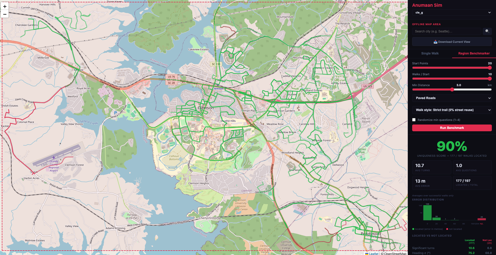
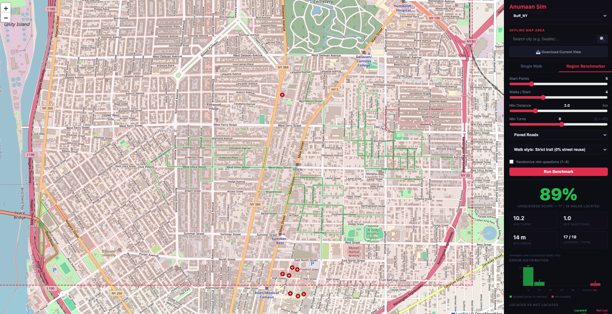
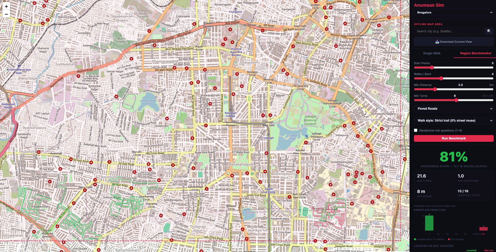
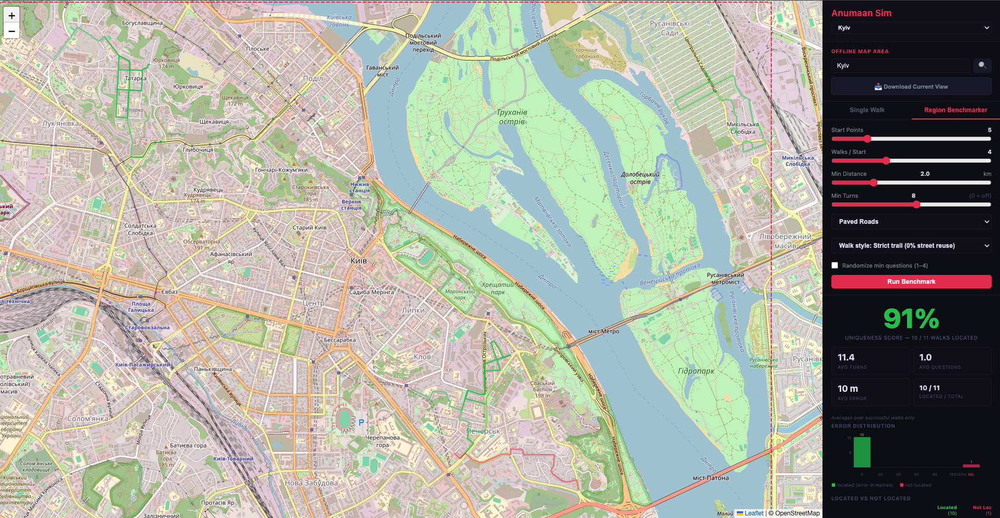
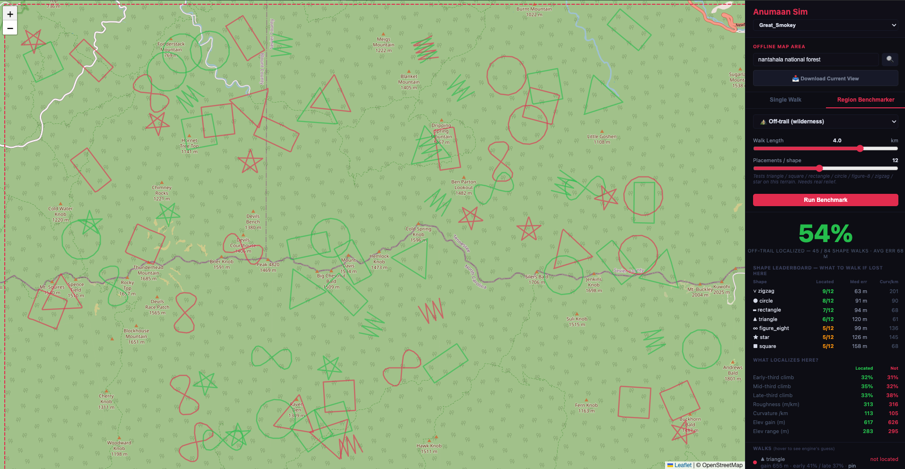

# Anumaan

<p align="center">
  
</p>

Anumaan (Hindi: अनुमान) means "to estimate", or "to reckon roughly". The main goal of this project is to figure out and implement an app which can help with navigation without GPS or Internet. GPS and Internet coverage has only gotten better and I think it will penetrate even more remote parts of the world with more satellites in the orbit. The reason for building this is to satisfy my own curiosity and also answer the below hypothetical:

"Scenario: internet is down, lower earth satellites have been shot down and GPS is jammed; how would you navigate from point A to point B?"

This is an imaginary scenario and it will probably never happen. I am just trying to figure out this problem given these constraints.

## The problem

To route someone from point A to point B without GPS, you need three things:

1. **An offline map** with routing built in, so you can run A* or any shortest-path algorithm without a network connection. This is easy.
2. **A starting position** on that map, so you know where to begin. This is easy.
3. **Your position on the map** as you are moving. This is hard.

Number 3 is hard because that is exactly what GPS provides: your phone pings the satellites constantly and keeps updating your position on the map, and also computes your moving speed from that. Position P1 at time T1 and position P2 at time T2 — straightforward math.

Without GPS we need a good proxy for number 3. I am using OpenStreetMap (OSM), which comes with points of interest, street names, intersections, traffic lights, speed limits, and a ton of other data, all storable on the phone.

If the system can verify points of interest along the way, it can locate itself on the map. The app runs A* (similar to what Google Maps does), loads the points of interest on the route, and asks the human: "have you reached this next POI?" Yes or no. Each answer corrects the position estimate.

This works but feels hacky. What if you go the wrong way? Google Maps detects that automatically with GPS and reroutes. So the app also has an "I am lost" feature. If you do not see the POI the app is asking about, you might be off route.

How does "I am lost" work without GPS? The app also downloads Digital Elevation Model (DEM) data alongside OSM. DEM gives you the elevation of every point on the map (resolution varies: NED for some areas, SRTM for others). When "I am lost" is pressed, the app starts collecting sensor data from the phone: compass direction and barometer readings. Direction comes from the compass; barometer values are a good proxy for elevation change. As you move, you are literally drawing a curve on the earth's surface with two properties: heading (degrees) and elevation change. Walk far enough, and you have drawn a curve long enough to ask the map: "is there a curve like this, with this elevation profile, somewhere in this area?" The map then runs the Terrain Contour Matching algorithm (TERCOM), the same class of algorithm used by Tomahawk missiles, and once it thinks it has found you it loads the nearest POIs and asks: "do you see this intersection?", "are you near this ridge?" Once confirmed, you are back on the map.

**There is a lot that is still pending and I am still working on it.**

## Real-world testing, then a simulator to scale

I tested this in the field. I walked real paths outside with the phone and ran the "I am lost" recovery on the sensor data it actually recorded. That is the real test, and it is how I know the approach works on real hardware.

But walking a fresh path every time I want to try a change does not scale. So I **also** built **AnumaanSim**, a simulator that runs the *same* recovery engine over any area in the world from my desk, no hiking required. It is not a replacement for the field tests; it is a way to try many more ideas, on many more places, far faster.

One caveat about the simulator, stated plainly: it feeds the engine **idealized** input. It assumes clean elevation changes and clean heading, as if the barometer and compass were perfect. Real phone sensors are not. The barometer drifts with weather and temperature, and the compass wanders near metal, cars, and buildings. So the simulator's accuracy numbers are an **optimistic ceiling**; real sensor noise pulls them down in the field. The simulator is for comparing ideas quickly and cheaply, not for predicting exact real-world accuracy.

The simulator has two modes:

- **Draw your own path.** Click a walk onto the map and watch the engine try to recover where you are, answering its Yes/No questions as the hypothesis cloud narrows down.
- **Run a benchmark.** Generate hundreds of random walks across a downloaded area and score how often the engine finds you, and how accurately. This is what produced the numbers below.

## Road navigation already has a simpler answer

If you are lost on a road, you have an easier option than any of the above. Look at the nearest street sign, type it into an offline map, and it tells you exactly where you are.

Localization on road networks was the first step, a way to build and validate the underlying TERCOM, POI verification system before pointing it at the harder problem. The hard problem is what happens when there is no street sign, no road, and nothing around you but terrain ; aka wilderness.

## What makes the wilderness case hard

Off-road is harder because the road constraint disappears. On a road you can only be on the road, which collapses the candidate set to a thin set of lines. In a national park or backcountry you could be anywhere.

What makes it especially hard is that big terrain repeats itself. A 3 km walk at 1,400 m elevation on a south-facing slope in the Smokies might look almost identical to a different 3 km walk at the same elevation on a different south-facing slope 8 km away. The engine either nails it or lands on one of these look-alikes, with little in between. The benchmarks below show that split clearly.

---

## What is in this repo

- **iOS app (`ios/`)** is a native Swift app with three screens: **Navigate** (follow a route by dead reckoning), **Track** (record a walk, work in progress), and **Lost** (recover your position from the terrain with TERCOM). I had claude build this so I could take my phone outside and test whether the dead-reckoning and terrain-matching ideas hold up in the real world, and the Lost mode has been tested on-device. Day-to-day iteration now happens in the simulator so I do not have to walk a fresh path for every experiment. See [`ios/README.md`](ios/README.md) to build and run it.
- **Map Simulator** (`/sim`) is where the "I am lost" mode is iterated on today. It runs the *same* Swift recovery engine (`AnumaanSim` CLI) over any downloaded area, in two modes: **draw your own path** on the map and watch the particle filter and Q&A engine converge onto your true position, or use the **Region Benchmarker** to run hundreds of random walks and score how often the engine recovers the correct position.

## Run the simulator

This project uses [uv](https://docs.astral.sh/uv/) and the [`pmtiles`](https://docs.protomaps.com/pmtiles/cli) command line tool. Install both once:

```bash
brew install uv pmtiles
uv sync                       # create the environment and install deps from uv.lock
uv run python run_app.py      # serves on http://127.0.0.1:8080
```

Open http://127.0.0.1:8080/sim in a browser.

1. **Download an area.** Use the geocoding search to find a location, then click **Download Current View**. This downloads the OSM road network and AWS elevation tiles for the bounding box.
2. **Choose a mode.** Paved Roads uses the road-snapping particle filter. Off-Trail uses terrain-contour TERCOM matching.
3. **Draw and run.** Click the map to draw a walk path (at least 2 waypoints), then click **Run Sim**.
4. **Answer questions.** The simulator asks Yes/No questions about landmarks along the path. Watch the hypothesis cloud (orange dots) narrow down to the true location (pink marker).
5. **Run a benchmark.** Switch to the **Region Benchmarker** tab to run hundreds of walks automatically and see aggregate accuracy, median error, and per-walk statistics on the map.

## Benchmark results

All numbers below come from **AnumaanSim**, so they assume the idealized sensors described above (clean elevation and heading). Read them as a ceiling for comparing approaches against each other, not as field accuracy.

### Road localization

The road engine performs well on dense road networks. These runs used a strict trail walk style (paths that never reuse a street segment), a minimum walk distance of 3 km, and randomized Q&A (1 to 4 questions per walk).

| Area | Accuracy | Notes |
|---|---|---|
| Clemson, SC | **90%** | Mixed suburban/rural grid |
| Buffalo, NY | **89%** | Dense urban grid |
| Bangalore, India | **81%** | Complex junction-heavy layout |
| Kyiv, Ukraine | **91%** | Wide arterials, river peninsula |

The numbers are not 100% because some walks are genuinely ambiguous: two streets of the same length and orientation are hard to tell apart from motion sensors alone.


*Clemson, SC. 90% of 197 strict-trail walks located to within 13 m median error.*


*Buffalo, NY. 89% accuracy on a dense urban grid. Red dots show the small cluster of misses near the southern boundary.*


*Bangalore. 81%. The higher junction density produces more ambiguous walk profiles.*


*Kyiv. 91%. The river peninsula and wide arterials give very distinct walk profiles.*

### Off-trail wilderness

The off-trail benchmark generates walks shaped like triangles, squares, rectangles, circles, and zigzags across real terrain at dozens of random placements. The engine tries to match each shape against the cached elevation map.

The Great Smoky Mountains result below shows 54%. The off-trail search covers roughly 89 km² with no prior on where the walk started. When the engine gets it right, it is often within tens of meters on a 3 to 5 km walk using only a phone barometer. When it gets it wrong, the miss lands at a different location at the same elevation with a similar up-and-down profile: a genuine terrain look-alike, not a random guess. This is a known fundamental limitation of TERCOM on repetitive terrain. See "Where this is going" below for how we plan to address it.


*Great Smoky Mountains. 54% of shape walks located. Green outlines are successful localisations; red outlines are misses. The shape leaderboard (right panel) shows which walk shapes performed best on this specific terrain. Self-crossing shapes (star and figure-eight) were universally the worst.*

---

## Project layout

```
ios/               # native Swift app (Navigate, Track, Lost screens)
app/
  sim.py           # benchmark runner, walk generator, off-trail engine dispatch
  terrain.py       # DEM reader, shape walk generator, terrain metrics
  routing.py       # road graph download, walk generator, coverage metrics
  server.py        # FastAPI server for the simulator
  static/sim.html  # simulator UI (MapLibre GL)
  static/vendor/   # MapLibre, pmtiles.js, Protomaps theme (vendored, offline)
data/              # downloaded areas, road graphs, DEM tiles (gitignored)
docs/              # benchmark screenshots
```

## Where this is going

The road case works well enough to be useful. The off-road case is the hard one, and it is where most of the upcoming work is aimed.

### The wilderness "Lost" mode

To study what works in the wilderness, we built a "simulate before you go" benchmark in the Map Simulator. You download a park (which caches its elevation tiles), choose Off-trail, and the tool runs the experiment for you. It lays out several walking shapes across the real terrain at many random spots, runs each one through the recovery engine, and reports which shape gets you found most often and how accurately. The best shape is not the same everywhere; it depends on the shape of the land. The idea is that you run this for your park before you go, and learn what to walk if you get lost there.

What we have learned from running it on the Great Smokies and Yosemite:

- On terrain with real relief, the engine locates a 3 to 5 km walk to within tens of meters, in under a second per walk.
- But the result is bimodal: dead-on or wrong by kilometers, with little in between. The misses land on a different spot at the same elevation that happens to have the same up-and-down pattern.
- Changing the walk shape helps at the margin, but it cannot fix a search that has nothing pinning it down.

The real fix is shrinking the set of places the person could be. Three planned approaches, in order of expected impact:

1. **Start from where they were last seen.** A lost hiker left a known trailhead or campsite. Search a circle around that point and grow it slowly with elapsed time. This turns a park-wide search into a small, solvable, local one.
2. **Fuse several short walks.** Walk a little, narrow the candidates, walk again, narrow further. One walk is the weakest possible input; a handful is far stronger.
3. **Use the compass.** An absolute heading rules out matches that only fit if you rotate them. Pinning the orientation removes a whole class of look-alike spots.

### Trail maps

Parks are laced with mapped hiking trails and OpenStreetMap already has them. The plan is to treat the trail network the same way we treat roads: download it with the area and snap to it.

If a lost hiker stumbles onto any trail, even without knowing which one, we can pin them to the trail graph and recover their position the same strong way the road engine works. And even off the trails, the nearby trail network shrinks the search. Trail maps are the bridge between the road case that already works and the open-terrain case that is still hard.

### Next directions

- Put this on a robot with a camera: identifying POIs visually should be doable, removing the human Q&A loop entirely.
- Explore deep sea terrain and build a simulation of the same TERCOM approach underwater.

## Notes

- The off-trail engine requires the release build of `AnumaanSim` (`swift build -c release` inside `ios/`). The debug build is too slow for the DTW search over the full terrain grid.
- The basemap is a single Protomaps `.pmtiles` file per area extracted with the `pmtiles` tool. No tile server, no API key.
- This is a demonstration and research prototype, not a production navigation system.
